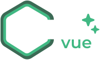

<div align="center">
  

&nbsp;

[](https://www.npmjs.com/package/craftvue)
[](https://www.npmjs.com/package/craftvue)
[](https://github.com/matmon12/craftvue/blob/main/LICENSE)
[](https://www.typescriptlang.org/)
[](https://vuejs.org/)

[📚 Documentation](https://matmon12.github.io/craftvue/) • [🎨 Storybook](https://matmon12.github.io/craftvue/) • [💾 npm](https://www.npmjs.com/package/craftvue)

</div>

# CraftVue

A modern Vue.js component library with beautiful, accessible components.

## Features

- 🎨 **Modern Design** - Beautiful and functional components
- 🛠️ **TypeScript** - Full type support out of the box
- 🎯 **Tree Shaking** - Import only the components you need
- 📱 **Responsive** - Adaptability for all devices
- 🌗 **Themes** - Support for light and dark themes
- ⚡ **Vue 3 Composition API** - Modern development approach
- 📦 **Lightweight** - Optimized build
- 🔧 **Customizable** - CSS variables for customization

## Packages

| Name                                                                             | Version                                                                                                                    |
| -------------------------------------------------------------------------------- | -------------------------------------------------------------------------------------------------------------------------- |
| [craftvue](https://github.com/matmon12/craftvue/tree/main/packages/craftvue)     | [](https://www.npmjs.com/package/craftvue)               |
| [@craftvue/icons](https://github.com/matmon12/craftvue/tree/main/packages/icons) | [](https://www.npmjs.com/package/@craftvue/icons) |

## 📦 Installation

### NPM

```bash
npm install craftvue @craftvue/icons
```

### PNPM

```bash
pnpm add craftvue @craftvue/icons
```

### Yarn

```bash
yarn add craftvue @craftvue/icons
```

## 🚀 Quick Start

### 1. Import styles

```typescript
// main.ts
import 'craftvue/style'
```

### 2. Use components

#### Global registration

```typescript
// main.ts
import { createApp } from 'vue'
import CraftVue from 'craftvue'
import App from './App.vue'

const app = createApp(App)
app.use(CraftVue)
app.mount('#app')
```

#### Selective import (recommended)

```vue
<template>
  <CButton variant="primary" @click="handleClick">
    <HomeIcon />
    Home
  </CButton>
</template>

<script setup lang="ts">
import { CButton } from 'craftvue'
import { HomeIcon } from '@craftvue/icons'

const handleClick = () => {
  console.log('Button clicked!')
}
</script>
```

## 📁 Monorepo Structure

```
craftvue/
├── apps/
│   ├── docs/          # 📚 Storybook documentation
│   └── playground/    # 🎮 Testing playground
├── packages/
│   ├── craftvue/      # 🎨 Main component library
│   └── icons/         # 🎭 Icon library
├── scripts/
└── README.md
```

## Available Components

| Component   | Description               | Status |
| ----------- | ------------------------- | ------ |
| `CButton`   | Buttons of various styles | ✅     |
| `CInput`    | Input fields              | ✅     |
| `CBadge`    | Badges and labels         | ✅     |
| `CIcon`     | Icons                     | ✅     |
| `CTabs`     | Tabs                      | ✅     |
| `CTabList`  | Tab list                  | ✅     |
| `CTab`      | Individual tab            | ✅     |
| `CFormItem` | Form element wrapper      | ✅     |

### 🎭 Icons (@craftvue/icons)

The library includes a set of optimized SVG icons:

```vue
<script setup lang="ts">
import { HomeIcon, AddIcon, CloseIcon, SearchIcon } from '@craftvue/icons'
</script>

<template>
  <HomeIcon />
  <AddIcon />
  <CloseIcon />
  <SearchIcon />
</template>
```

## 🎨 Customization

### CSS Variables

```css
:root {
  /* Main colors */
  --main-color: #ffffff;
  --prime-color: #bea87b;
  --secondary-back: #262626;
  --invalid-color: #f87171;

  /* Component colors */
  --button-primary-filled-color: #ffffff;
  --button-primary-filled-back: var(--prime-color);
  --button-primary-filled-back-hover: color-mix(in srgb, var(--prime-color) 100%, #fff 10%);
}
```

### Themes

CraftVue supports switching between light and dark themes through CSS variables:

```css
/* Dark theme (default) */
:root[data-theme='dark'] {
  --main-color: #ffffff;
  --prime-color: #bea87b;
  --secondary-back: #262626;
  --invalid-color: #f87171;
}

/* Light theme */
:root {
  --main-color: #000000;
  --prime-color: #bea87b;
  --secondary-back: #374151;
  --invalid-color: #f87171;
}
```

## 🔧 Development

### Requirements

- Node.js 18+
- pnpm 8+

### Install dependencies

```bash
pnpm install
```

### Development mode

```bash
# Run all applications
pnpm run dev:all

# Component library only
pnpm run dev:lib

# Icons only
pnpm run dev:icons

# Storybook
pnpm run dev:docs
```

### Build

```bash
# Build all packages
pnpm run build:all

# Library only
pnpm run build:lib

# Icons only
pnpm run build:icons
```

### Linting and type checking

```bash
# ESLint check
pnpm run lint

# TypeScript type check
pnpm run type-check
```

## Documentation

- **[Storybook](https://matmon12.github.io/craftvue/)** - Interactive documentation and examples

## 🤝 Contributing

We welcome contributions to CraftVue development!

1. 🍴 Fork the repository
2. 🌿 Create a branch for new feature (`git checkout -b feature/amazing-feature`)
3. 💾 Commit changes (`git commit -m 'feat: Add amazing feature'`)
4. 📤 Push changes (`git push origin feature/amazing-feature`)
5. 🔄 Create a Pull Request

## 📄 License

This project is licensed under the MIT License. See the [LICENSE](LICENSE) file for details.

---

<div align="center">

**Made with ❤️ for the Vue.js community**

[⭐ Star us](https://github.com/matmon12/craftvue) • [🐛 Report bug](https://github.com/matmon12/craftvue/issues) • [💡 Suggest idea](https://github.com/matmon12/craftvue/discussions)

</div>
